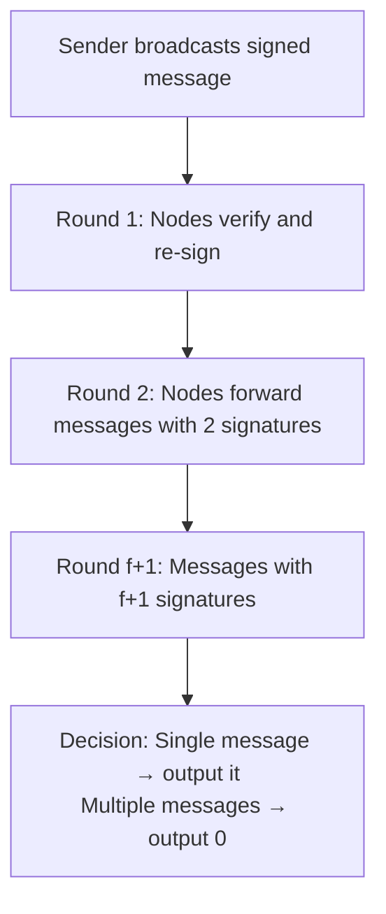
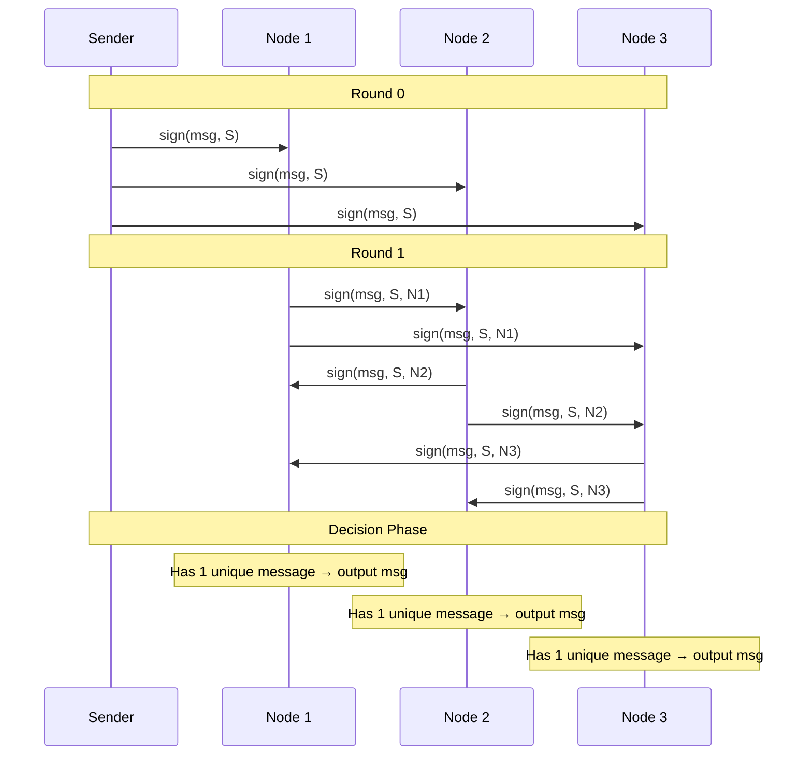
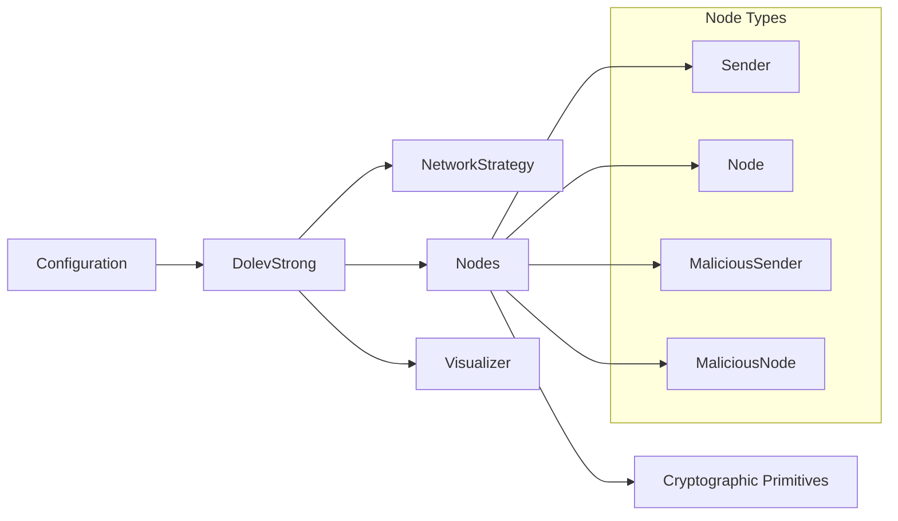
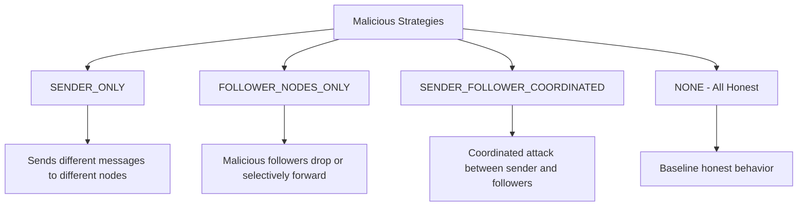

# Dolev-Strong Protocol Implementation

This repository contains a complete implementation of the Dolev-Strong consensus protocol with interactive visualization capabilities.

## Overview

The Dolev-Strong protocol is a Byzantine fault-tolerant consensus algorithm that allows a network of nodes to reach agreement on a value, even when some nodes are malicious. It guarantees that all honest nodes will either agree on the same value or output a default value (0), regardless of Byzantine failures.

### Key Properties

- **Byzantine Fault Tolerance**: Tolerates up to `f` malicious nodes in a network of `n` nodes
- **Deterministic**: Always produces the same result for the same inputs
- **Signature-based**: Uses cryptographic signatures to ensure message authenticity
- **Round-based**: Operates in `f + 1` rounds where `f` is the number of malicious nodes

### How It Works

## Protocol Algorithm

1. **Initialization**: Each node generates a key pair and registers their public key
2. **Round 0**: Sender signs and broadcasts their input message
3. **Round k (1 ≤ k ≤ f+1)**: 
   - Each node processes messages with exactly k signatures
   - Verifies all signatures are valid and unique
   - Adds their own signature and broadcasts to all peers
4. **Decision**: After f+1 rounds, each node outputs:
   - The unique message if only one message was received
   - 0 if multiple different messages were received

## Protocol Flow Example

## Implementation Architecture

### Core Components

### File Structure

- **`models.py`**: Configuration classes and enums for different attack strategies
- **`primitives.py`**: Cryptographic operations (RSA signatures, verification)
- **`nodes.py`**: Node implementations (honest, malicious, coordinated attacks)
- **`strategy.py`**: Network setup strategies for different scenarios
- **`protocol.py`**: Main protocol orchestration
- **`vizualize.py`**: Interactive visualization with matplotlib

### Attack Scenarios

The implementation supports several malicious strategies:

### Visualization Features

The interactive visualizer provides:

- **Node representation**: Color-coded nodes (blue=honest sender, red=malicious sender, green=honest node, orange=malicious node)
- **Message flow**: Animated arrows showing message passing between nodes
- **Round control**: Slider to navigate through protocol rounds
- **Play/Pause**: Automatic animation of the protocol execution
- **Message tracking**: Display of messages received by each node
